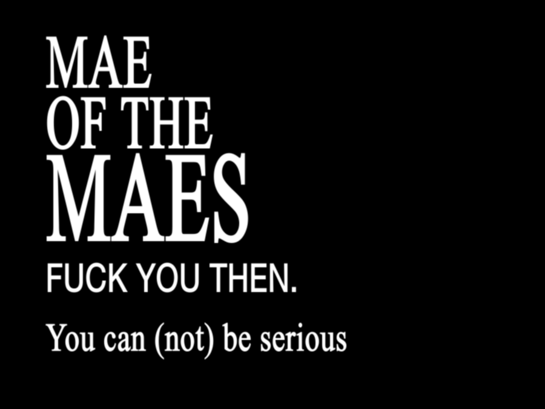

<meta
  http-equiv="Content-Security-Policy"
  content="default-src 'self'; script-src static.cloudflareinsights.com; connect-src cloudflareinsights.com;  script-src 'self' ajax.cloudflare.com; object-src 'none'"/>

# Fuck.
Hi, writing this now is difficult because I still have attachment to you. At least for the you I like.
It's also a blow to my own pride because I'll have to admit to myself I did something wrong.

## Nescience
Well, when I arrived at this ungodly ship, I came from my ex. Leaving that was incredibly uncomfortable, I enjoyed my presence with him a lot because they were there for me on a day to day basis.
I did recover slowly (after moving gigabytes of data).

And then eventually you entered the stage, I thought with you I finally hit a balance in what I was looking for a partner without going into too much detail here. 

But instead I found massive construction sites of a person, just from the oversight.

You are bigoted, you came in after lots of abusive relationships and you couldn't find peace with yourself.
And I was looking to help you, really.

### Steady as she goes

So despite a lot of problems, I was looking open to compromise with my very values. Because I thought I could work out any problems.
The thing that makes this painful is that I really do like you, I enjoy the time we've had just watching media and nerding about things.
If you put your mind to it, you can be a really great partner that's fun to engage about topics with.
And I adored you for the things you were proficient at, I think I will probably never get to the same level as content creation as you are.

Or maybe I do, *with enough time and effort*.

But with more time, I came to the realization what person you actually were. 
You have a lot of ugly sides. Not that I'm exempt of my own.

### The line emerges

So, what were those ugly sides?
Being judged for my interests, getting harassed for hanging out with my friends, racist comments, a disregard for me and my friends, threats of suicide and outright encouraging suicide to me, staffing and helping         despite her questionable track record,

Your worst behavior showed an complete lack of respect towards me and my social circle, which is completely unacceptable for someone in a relationship. It was a toxic relationship, and I stuck with it.
## Open letter

Let me not get caught up too much and get to the point of this, you're a verifiably horrible person.

Don't tread off what I've tried to help you on even if you can exploit others again, I wanted to help you to become a person that people would like to hang around with. You were in tears about how nobody wants to be friends with you, how everybody betrays and neglects you; that is to help you with it.

I needed to endure a lot of abuse for you and defend you for it, because you said you'd look to bettering yourself. That didn't go far.
I can't help anybody who doesn't want to be helped.
 
I tried to wrap this up diplomatically but in the final sprint, you started to harass me without any filter which signed your fate.
Now instead you're left with this terrible embargo.

Look, I may be bitter towards you right now (and looking at your reaction, probably you too) but I will likely soften up to it with time. 

If you're better by then, I'd be fine with getting in contact again and having a drink about it. Maybe we can laugh about how naive we were back then.
Or maybe you will never reflect, you will continue to see me as *"the most ungrateful fucking partner"* you've ever had. Not my choice.

But until then, please:

**Get off my Fediverse handles, get rid of my links and profiles and pretend we never met.**
Trying to stalk what I do and who I'll be with will make you sick and bitter, the exact kind of behavior that turned me sick with my ex that long time ago.

# Postrēmō
At last, perhaps I can divorce myself from this by writing this. ~~Even if just for myself.~~

In August, in an very early draft that was more softer towards you I wrote:
> At some point, I have to draw the line and if you're reading this, I'm probably there.

And now I can stick to my word.

 

*See you space cowboy.*